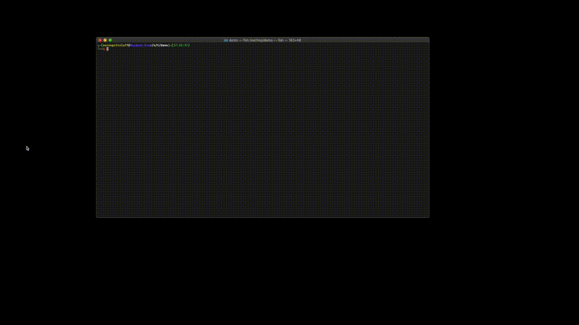

# Riff - Raft in your browser!

This project was created as an example of leveraging multi-platform compilation to drive development and testing -- namely by running the server code directly in your browser! In fact, you can run this repo's code now [right here](https://aaronp.github.io/riffd) (though currently only browsers w/ BroadcastChannel are supported until I polyfill that ... sorry Safari/IE users!)

It was written using [ZIO](https://zio.dev/) and [ScalaJS](https://www.scala-js.org/), though this project is less about the actual code and more about the concept of being able to do 
meaningful testing where bringing cluster nodes up and down is as straight-forward as opening/closing a browser tab: 

# Inventing On Principal
The idea for this project was inspired way back in 2012 from Bret Victor's amazing [Inventing On Principle talk](https://vimeo.com/36579366).

The concept of immediate feedback and ease of testability is well-known. This project is meant to be a real-world example (a RAFT [consensus algorithm](consensus.md) implementation) which 
has to deal with failures, availability and randomness in order to provide both leader election and a consistent replicated log within a cluster.

After the excellent 'immediate feedback' talk, I always wanted to use multi-platform builds (e.g. compiling the same source to bytecode, javascript and native) 
so that I could run my server-code in the browser. 

Creating, pausing or destroying a worker would be as simple as opening (or closing) a browser tab.

# Accelerate - do testing w/o the need for an integrated environment

I was recently reminded of this interest as I started Chapter 5 on Architecture in the __[Accelerate](https://www.amazon.co.uk/Accelerate-Software-Performing-Technology-Organizations/dp/1942788339)__ book:

> __Focus On Deployability And Testability__
>
> Although in most cases the type of system you are building is not important in terms of achieving high performance, two _architectural characteristics_ are.
> Those who agreed with the following statements were more likely to be in the high-performing group:
>  * We can do most of our testing without requiring an integrated environment
>  * We can and do deploy or release our application independently of other applications/services it depends on

This project is meant just to serve as an example, demonstration, and taking point for those principles.

I have yet to apply the idea of multi-platform builds in a real-world project, but how great would it be to take advantage 
both of the huge ecosystem and uncountable hours in the Java space dedicated to tooling, tuning, monitoring, libraries, security, etc, 
but also have fun, immediately-testable feedback during development by running (and debugging) that server code IN THE BROWSER.  

Unfortunately this demo makes use of BroadcastChannels (so no Safari/IE I'm afraid). If that's not you, then [have a play](https://aaronp.github.io/riffd)!
