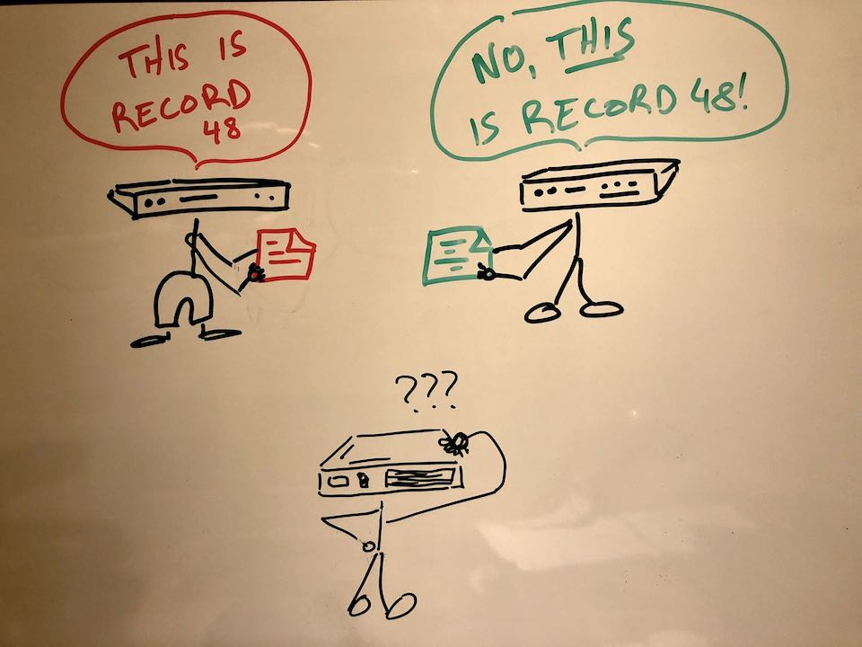
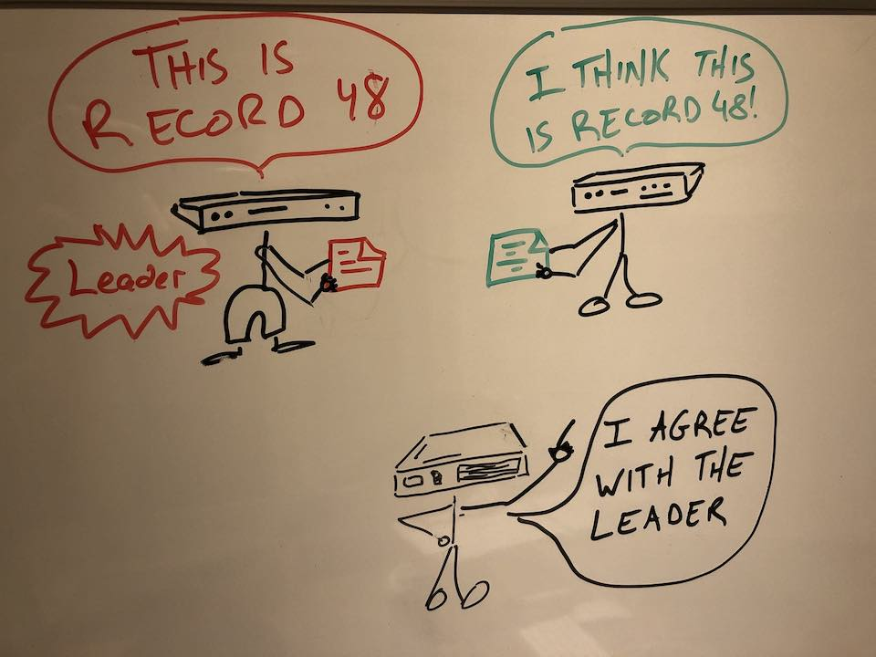

# Consensus Algos

You would be hard-pressed to find a protocol better laid out and with such fantastic supporting materials as what Diego Ongaro and John Ousterhout have done with the [RAFT consensus algorithm](https://raft.github.io/).

The general idea of a consensus algorithm is to get different machines to agree on the same series of events or records, even in the presence of failures.

One way to solve this problem is by electing a single 'leader' machine to be in charge, and for the rest to accept what the leader tells them:

Being able to employ something like leader election and a distributed commit log can be very useful when solving distributed compute problems.

There are far better places to read more about RAFT than here, so I'll just say that the reason I chose this problem as an immediate feedback example was:
 * The responses from one node becomes the input for another, so this was a good case to prove the feedback messages worked in concert with each other
 * It is a practical application which can be used to underpin further examples/applications
 * Its use of randomness makes it an interesting problem to test - and I wanted to further 'kick the tyres' on [ZIO](https://zio.dev/)

[back](README.md)